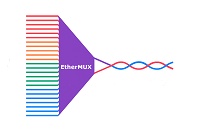

# EtherMux is a protocol designed to run over Single Pair Ethernet.  
## Status: Design Phase  
Ultra low latency signaling combined with serial data transport.  

|📂 src   | Source code for Pico microcontroller|  
|----------|--------------------------------------|
|📂 Docs   |  Documentation|  
|📂 Download |  Pre-Compiled files ready to install.|  

